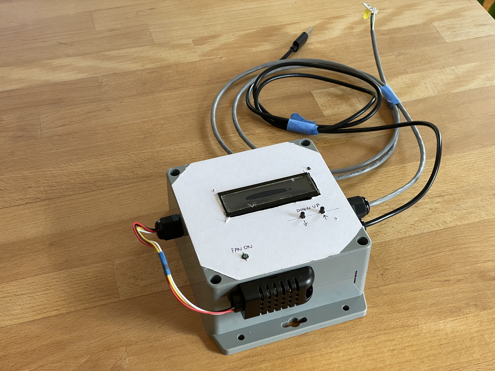
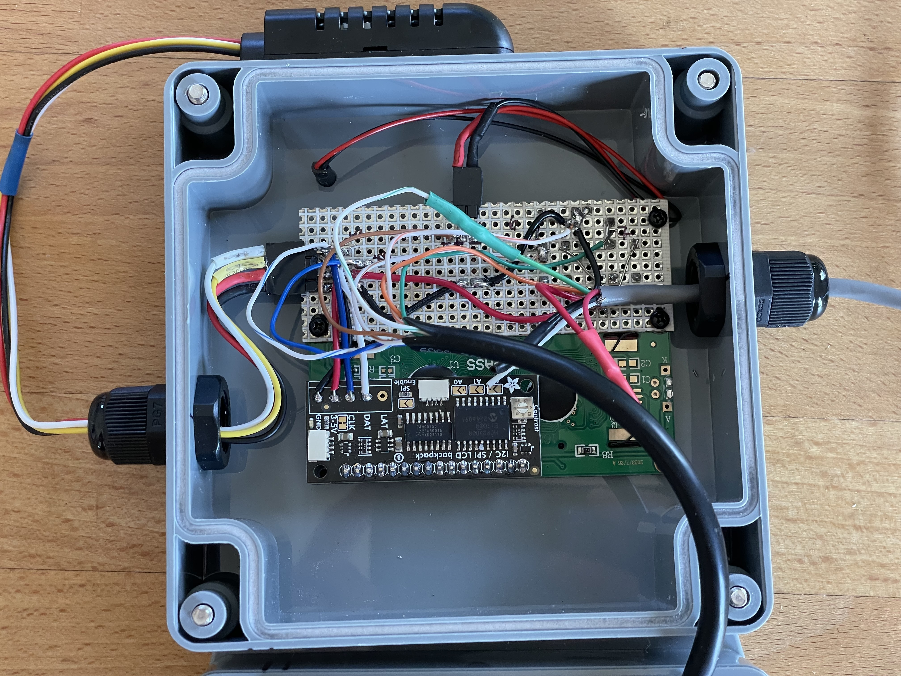
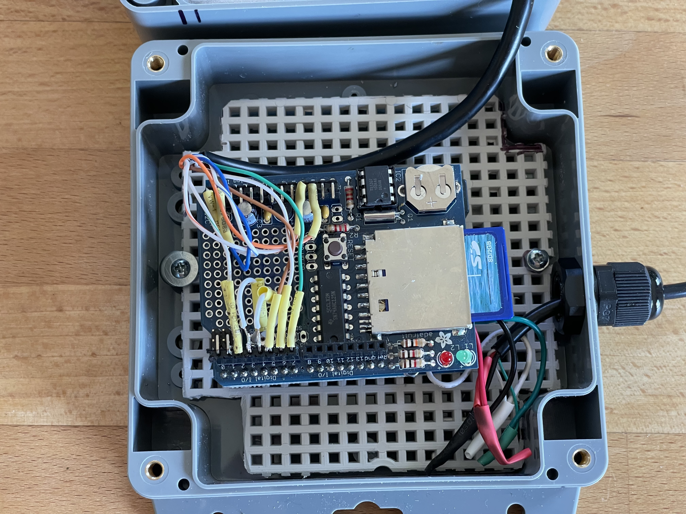

# arduino-humidity-fan-switch
Humidity fan switch that starts/stops fan based on a regulable humidity setpoint, 

The system also logs variables in SD card:
* Timestamp
* Humidity %
* Temperature

Using the front panel buttons to:
* Up increases the % humidity setpoint
* Up increases the % humidity setpoint

|    Humidity controller| |
| -------- | ------- |
| Actuator  | Fan    |
| Process value | Humidity     |
| Setpoint    | adjustable wih button 0-100%    |
| Action    | Direct - humidity increase turns fan on   |

# Device overview

## List of materials
Link to store:
* [Arduino Uno](https://store-usa.arduino.cc/products/arduino-uno-rev3?selectedStore=us) ( mine is 10 years old)
* SD card shield - Adafruit 1141 (mine is v1 version 10 years old)
* [Enclosure](https://www.digikey.com/en/products/detail/bud-industries/PN-1336-DGMB/4897006)
* [Enclosure back plate](https://www.digikey.com/en/products/detail/bud-industries/NBX-10984-PL/2057387)
* LCD screen - Adafruit 292
* I2C LCD controller - Adafruit 292
* Humidity Sensor - Adafruit 5181
* Front panel buttons - Adafruit 1490
* [Fron panel LED](https://www.digikey.com/en/products/detail/lumex-opto-components-inc/SSI-LXH312GD-150/145100)
* [Cable glands](https://www.digikey.com/en/products/detail/bud-industries/IPG-2227/5291485)

Other materials:
* M2.5 screws
* Protoboard
* Single wires
* RJ45 cable to interface LCD with main board
* USB cable connected to Arduino Uno board

## Arduino code dependencies
List of libraries you have to install in Arduino IDE to run the code:
* Adafruit RTCLib
* Adafruit LiquidCrystal
* Adafruit AHTX0

## Image gallery
Back of the front plate

Microcontroller with SD card shield

